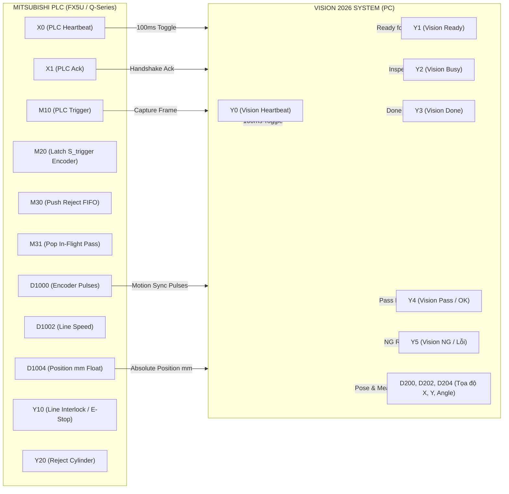

# Sơ Đồ Thang Ladder Trực Quan (Visual Ladder Diagram)
## Tương Thích: Mitsubishi GX Works 3 / GX Works 2 / FX5U / Q Series / iQ-R

---

## 1. Bản Đồ Bộ Nhớ Kết Nối Vision PC $\leftrightarrow$ PLC (Memory Map)



---

## 2. Sơ Đồ Ladder Trực Quan Từng Mạng (Ladder Networks)

### 🟢 MẠNG 1: Tạo Nhịp Tim PLC (PLC Heartbeat 100ms Toggle)
*PLC phát nhịp tim đảo bit liên tục mỗi 100ms gửi sang Vision PC để xác nhận PLC đang hoạt động bình thường.*

```text
  M8000 (Always ON)      T1 (100ms Timer)             +---[ T1 K1 ]---+ (Timer 100ms)
-------[ ]--------------------[/]--------------------+
                                                      +---[ ALT X0 ]--+ (Đảo bit X0 mỗi 100ms)
```

---

### 🟢 MẠNG 2: Watchdog Giám Sát Nhịp Tim Vision PC (300ms Timeout) & Liên Động An Toàn
*Nếu Vision PC bị đơ, mất kết nối hoặc cáp Ethernet bị rút quá 300ms, PLC ngắt rơ-le an toàn `Y10` dừng băng tải ngay lập tức.*

```text
  Y0 (Vision Heartbeat)
-------[ ]------------------------------------------------[ PLS M205 ]- (Bắt cạnh lên)

  Y0 (Vision Heartbeat)
-------[/]------------------------------------------------[ PLS M206 ]- (Bắt cạnh xuống)


  M8000          M205           M206
---[ ]------------[/]------------[/]----------------------[ T0 K3 ]---- (Watchdog 300ms)


  T0 (Watchdog Timeout)
---[ ]------------------------------------------------+---[ SET M202 ]- (Cảnh báo lỗi Vision)
                                                      |
                                                      +---[ RST Y10 ]-- (Ngắt liên động chuyền)


  M205 (Nhịp tim trở lại)
---[ ]------------------------------------------------+---[ RST M202 ]- (Xóa lỗi)
  M206                                                |
---[ ]------------------------------------------------+---[ SET Y10 ]-- (Cho phép chạy chuyền)
```

---

### 🟢 MẠNG 3: Bắt Tay Kích Hoạt Chụp Ảnh & Chốt Tọa Độ Encoder Lúc Chụp (In-Flight Latch)
*Khi cảm biến phôi `X2` phát hiện hàng vào đúng vị trí và Vision PC sẵn sàng (`Y1=1`, `Y2=0`, không lỗi), PLC phát xung `M10` kích camera chụp và `M20` chốt ngay tọa độ $S_{\text{trigger}} = D1004$.*

```text
  X2 (Sensor)   Y1 (Vision Ready)  M202 (No Fault)  Y2 (Not Busy)
------[ ]--------------[ ]---------------[/]--------------[/]----+----[ PLS M10 ]- (Bắn xung Trigger)
                                                                 |
                                                                 +----[ PLS M20 ]- (Chốt tọa độ S_trigger)
```

---

### 🟢 MẠNG 4: Nhận Kết Quả Kiểm Tra & Bắn Tín Hiệu PLC Ack (Handshake Complete)
*Khi Vision hoàn thành tính toán (`Y3=1`), phân loại Pass/NG và bật `X1 (PLC Ack)` báo cho Vision PC biết PLC đã chốt kết quả.*

```text
  Y3 (Vision Done)
-------[ ]------------------------------------------------+-------[ OUT X1 ]- (Bật PLC Ack)
                                                          |
                                           Y5 (Vision NG) |
                                          -------[ ]------+-------[ PLS M30 ]- (Nạp Shift Register NG)
                                                          |
                                           Y4 (Vision OK) |
                                          -------[ ]------+-------[ PLS M31 ]- (Giải phóng phôi Pass)


  Y3 (Vision Done)
-------[/]--------------------------------------------------------[ RST X1 ]- (Hạ PLC Ack về 0)
```

---

### 🟢 MẠNG 5: Hàng Đợi Shift Register & Thổi Loại Bỏ Sản Phẩm NG (Reject Piston)
*Khi phôi di chuyển trên băng tải tới đúng tọa độ $S_{\text{target}} = S_{\text{trigger}} + L_{\text{reject}}$ (dung sai $\pm 10\text{ mm}$), PLC kích van điện từ / vòi khí `Y20` trong 100ms để thổi sản phẩm lỗi vào thùng NG.*

```text
  [ D1004 >= (Target - Tol) ] (Vị trí mm >= Đích Reject)
--------------[ ]-----------------------------------------+-------[ OUT M40 ]- (Kích hoạt Reject)
  [ D1004 <= (Target + Tol) ] (Vị trí mm <= Đích + Tol)   |
--------------[ ]-----------------------------------------+


  M40                                                 +---[ OUT Y20 ]-+ (Van Xylanh Reject ON)
-------[ ]--------------------------------------------+
                                                      +---[ T10 K1 ]--+ (Timer 100ms)


  T10 (Sau 100ms)
-------[ ]--------------------------------------------+---[ RST Y20 ]-+ (Ngắt Van Xylanh)
                                                      |
                                                      +---[ RST M40 ]-+
```

---

### 🟢 MẠNG 6: Cộng Dồn Bộ Đếm Thống Kê Sản Lượng (Total / OK / NG)
*Tự động tăng các thanh ghi 32-bit (Double Word DINT) lưu trong PLC khi hoàn thành kiểm tra từng sản phẩm.*

```text
  Y3 (Vision Done)
-------[ ]------------------------------------------------[ DADD D300 K1 D300 ]- (Tổng kiểm tra)

  Y4 (Vision Pass - OK)
-------[ ]------------------------------------------------[ DADD D302 K1 D302 ]- (Tổng OK)

  Y5 (Vision NG - Lỗi)
-------[ ]------------------------------------------------[ DADD D304 K1 D304 ]- (Tổng NG)
```
