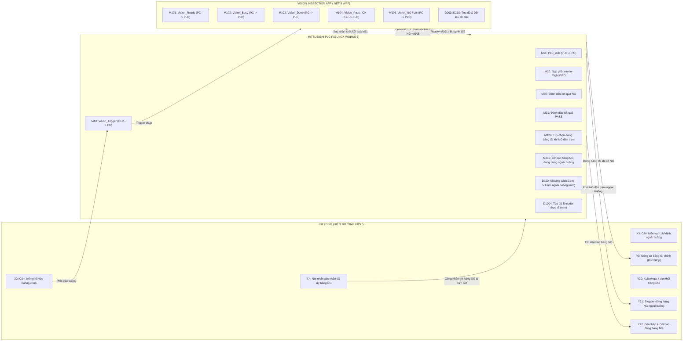

# Sơ Đồ Thang Ladder & Trình Tự Bắt Tay PLC FX5U (GX Works 3)
## Kiến Trúc Dây Chuyền: Kiểm Tra Nối Tiếp (In-Flight) & Dừng Hàng NG Ngoài Buồng Kiểm Tra

---

## 1. Bản Đồ Truyền Thông & I/O FX5U (MC Protocol / SLMP)


```mermaid
graph LR
    subgraph SENSORS_ACTUATORS["FIELD I/O (HIỆN TRƯỜNG FX5U)"]
        X2["X2: Cảm biến phôi vào buồng chụp"]
        X3["X3: Cảm biến trạm chỉ định ngoài buồng"]
        X4["X4: Nút nhấn xác nhận đã lấy hàng NG"]
        Y0["Y0: Động cơ băng tải chính (Run/Stop)"]
        Y20["Y20: Xylanh gạt / Van thổi hàng NG"]
        Y21["Y21: Stopper dừng hàng NG ngoài buồng"]
        Y22["Y22: Đèn tháp & Còi báo động hàng NG"]
    end

    subgraph PLC_FX5U["MITSUBISHI PLC FX5U (GX WORKS 3)"]
        M10["M10: Vision_Trigger (PLC -> PC)"]
        M11["M11: PLC_Ack (PLC -> PC)"]
        M20["M20: Nạp phôi vào In-Flight FIFO"]
        M30["M30: Đánh dấu kết quả NG"]
        M31["M31: Đánh dấu kết quả PASS"]
        M120["M120: Tùy chọn dừng băng tải khi NG đến trạm"]
        M215["M215: Cờ báo hàng NG đang dừng ngoài buồng"]
        D100["D100: Khoảng cách Cam -> Trạm ngoài buồng (mm)"]
        D1004["D1004: Tọa độ Encoder thực tế (mm)"]
    end

    subgraph VISION_PC["VISION INSPECTION APP (.NET 8 WPF)"]
        M101["M101: Vision_Ready (PC -> PLC)"]
        M102["M102: Vision_Busy (PC -> PLC)"]
        M103["M103: Vision_Done (PC -> PLC)"]
        M104["M104: Vision_Pass / OK (PC -> PLC)"]
        M105["M105: Vision_NG / Lỗi (PC -> PLC)"]
        D200["D200..D210: Tọa độ & Dữ liệu đo đạc"]
    end

    X2 -->|Phôi vào buồng| M10
    M10 -->|Trigger chụp| VISION_PC
    VISION_PC -->|Ready=M101 / Busy=M102| PLC_FX5U
    VISION_PC -->|Done=M103 / Pass=M104 / NG=M105| PLC_FX5U
    PLC_FX5U -->|Xác nhận chốt kết quả M11| VISION_PC
    
    PLC_FX5U -->|Phôi NG đến trạm ngoài buồng| Y21
    PLC_FX5U -->|Dừng băng tải khi có NG| Y0
    PLC_FX5U -->|Còi đèn báo hàng NG| Y22
    X4 -->|Công nhân gỡ hàng NG & bấm nút| PLC_FX5U
```

---

## 2. Biểu Đồ Thời Gian (Timing Diagram): Pipelined Inspection & Dừng Ngoài Buồng

```text
[Phôi 1 vào buồng]   ---> X2 Trigger ---> M101=1 ---> Vision phân tích ---> KẾT QUẢ: PHÔI 1 LỖI (NG)!
                          (Băng tải Y0 vẫn chạy, phôi 1 di chuyển ra ngoài buồng, khoảng cách D100 mm)
                          
[Phôi 2 vào buồng]   ---> X2 Trigger ---> M101=1 ---> Vision phân tích ---> KẾT QUẢ: PHÔI 2 ĐẠT (OK)!
                          (Phôi 2 được kiểm tra bình thường trong lúc phôi 1 đang di chuyển!)

[Phôi 3 vào buồng]   ---> X2 Trigger ---> M101=1 ---> Vision phân tích ---> KẾT QUẢ: PHÔI 3 ĐẠT (OK)!
                          (Tiếp tục kiểm tra nối tiếp không gián đoạn)

[Phôi 1 đến trạm]    ---> Tọa độ = D100 (hoặc chạm cảm biến X3 ngoài buồng):
                          • Bật Stopper chặn hàng: Y21 = ON
                          • Dừng băng tải chính:   Y0  = OFF (nếu M120=ON)
                          • Bật đèn còi báo NG:    Y22 = ON
                          • Báo cờ HMI:            M215 = ON
                          ===> Phôi 1 (NG) DỪNG CHÍNH XÁC TẠI TRẠM NGOÀI BUỒNG KIỂM TRA!

[Xử lý hoàn tất]     ---> Công nhân lấy phôi 1 ra, bấm nút xác nhận X4 (hoặc M211):
                          • Hạ Stopper:            Y21 = OFF
                          • Khởi động lại băng tải: Y0  = ON
                          • Tắt còi đèn:           Y22 = OFF
                          • Xóa phôi 1 khỏi FIFO, Phôi 2 (OK) trôi qua bình thường!
```

---

## 3. Sơ Đồ Thang Ladder (FX5U Networks)

### 🟢 MẠNG 1: Bắt Tay Kích Hoạt Chụp Ảnh Trong Buồng (Handshake Trigger)
*Khi phôi chạm cảm biến X2 và Vision PC sẵn sàng (M101), PLC phát xung M10 cho PC và chốt xung M20 nạp hàng đợi.*

```text
   X2 (Sensor buồng)   M101 (Ready)      M202 (No Fault)   M102 (Not Busy)
-------[ ↑ ]----------------[ ]----------------[/]----------------[/]----+----[ PLS M10 ]- (Xung Trigger Vision)
                                                                         |
                                                                         +----[ PLS M20 ]- (Chốt tọa độ S_trigger)
```

### 🟢 MẠNG 2: Nhận Kết Quả Kiểm Tra Từ Vision PC & Phản Hồi PLC Ack
*Khi Vision PC tính toán xong (M103=1), PLC đọc M104/M105, cập nhật trạng thái vào FIFO và gửi M11 xác nhận.*

```text
   M103 (Vision Done)
-------[ ]------------------------------------------------+--------------[ OUT M11 ]- (PLC Ack)
                                                          |
                                           M105 (NG)      |
                                          -------[ ]------+--------------[ PLS M30 ]- (Nạp kết quả NG vào FIFO)
                                                          |
                                           M104 (Pass)    |
                                          -------[ ]------+--------------[ PLS M31 ]- (Nạp kết quả OK vào FIFO)

   M103 (Vision Done)
-------[/]---------------------------------------------------------------[ RST M11 ]- (Hạ PLC Ack khi PC reset)
```

### 🟢 MẠNG 3: Dừng Đúng Sản Phẩm NG Tại Vị Trí Chỉ Định Ở Ngoài Buồng Kiểm Tra
*Khi phôi đầu tiên trong hàng đợi là NG (Status = 2) và tọa độ thực tế D1004 đạt tới đích ngoài buồng:*

```text
   [ FIFO_Head_Status == 2 ] (Phôi dẫn đầu là NG)
---------------[ ]----------------------------------------+
   [ D1004 >= (Target - Tol) ] OR [ X3 (Sensor ngoài) ]   |
---------------[ ]----------------------------------------+--------------[ SET Y21 ]-- (Bật Stopper chặn hàng NG)
                                                          |
                                                          +--------------[ SET Y22 ]-- (Bật còi đèn báo hàng NG)
                                                          |
                                                          +--------------[ SET M215 ]- (Cờ HMI báo NG dừng ngoài trạm)
                                                          |
                                           M120 (StopConv)|
                                          -------[ ]------+--------------[ RST Y0 ]--- (Dừng băng tải chính)
```

### 🟢 MẠNG 4: Nút Nhấn Xác Nhận Đã Lấy Hàng NG Ra Khỏi Trạm Ngoài Buồng
*Công nhân lấy hàng NG ra khỏi cữ chặn và bấm nút X4: giải phóng cơ cấu dừng, cho băng tải tiếp tục chạy.*

```text
   X4 (Nút Ack công nhân) OR M211 (HMI Reset)       Y21 (Stopper đang giữ)
-------------------[ ↑ ]------------------------------------[ ]----------+----[ RST Y21 ]-- (Hạ Stopper)
                                                                         |
                                                                         +----[ RST Y22 ]-- (Tắt còi đèn)
                                                                         |
                                                                         +----[ RST M215 ]- (Xóa cờ HMI)
                                                                         |
                                                                         +----[ SET Y0 ]--- (Khôi phục chạy băng tải)
                                                                         |
                                                                         +----[ Shift FIFO ] (Đẩy phôi tiếp theo lên)
```
