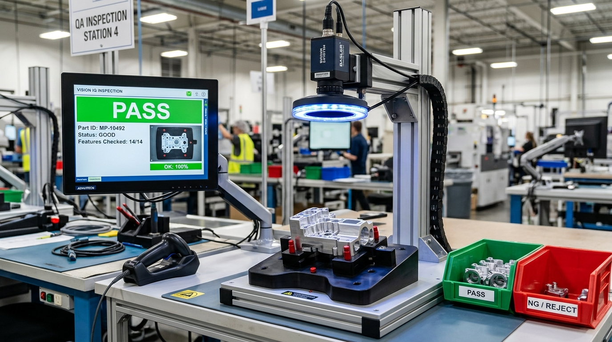
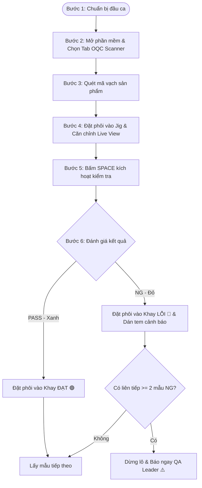
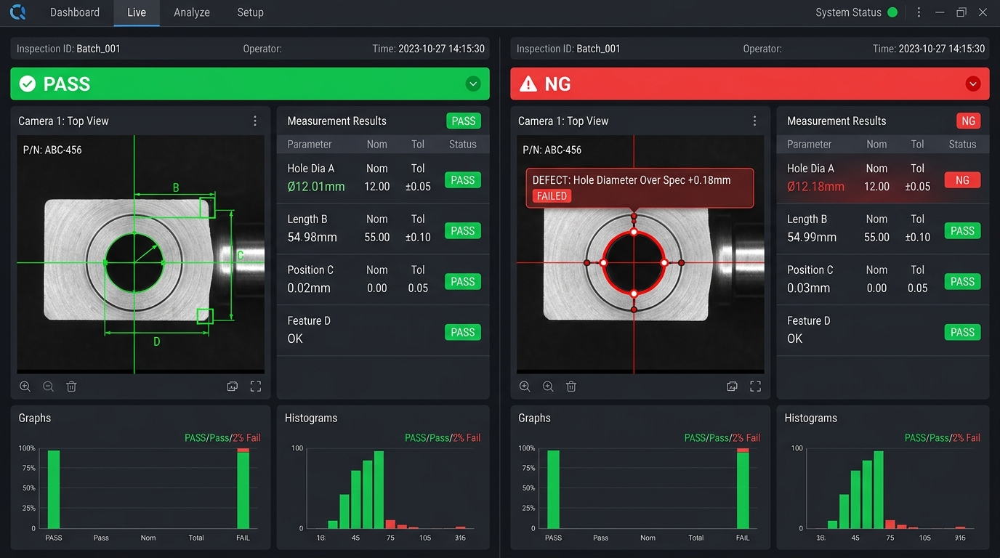

# QUY TRÌNH THAO TÁC CHUẨN (SOP)
## KIỂM TRA LẤY MẪU SẢN PHẨM BẰNG HỆ THỐNG VISION (OQC SAMPLING INSPECTION)

---

| **MÃ TÀI LIỆU** | **PHIÊN BẢN** | **NGÀY HIỆU LỰC** | **BỘ PHẬN ÁP DỤNG** | **TRẠNG THÁI** |
| :---: | :---: | :---: | :---: | :---: |
| **SOP-OQC-VIS-01** | **2.0** | **2026-09-08** | **Bộ Phận Đảm Bảo Chất Lượng (QA / OQC)** | **Ban Hành Chính Thức** |

---

## 1. MỤC ĐÍCH & PHẠM VI ÁP DỤNG

### 1.1. Mục đích
- Chuẩn hóa quy trình thao tác kiểm tra ngoại quan và kích thước sản phẩm bằng hệ thống thị giác máy tính (**CMS VINA VISION SYSTEM**).
- Đảm bảo công nhân kiểm tra chất lượng xuất xưởng (OQC Inspector) thao tác đúng trình tự, chính xác, ngăn chặn 100% sản phẩm lỗi (NG) lọt qua công đoạn tiếp theo hoặc giao cho khách hàng.
- Nâng cao tính đồng nhất trong đánh giá chất lượng, ghi nhận lịch sử và truy xuất nguồn gốc dữ liệu đo kiểm theo từng lô hàng.

### 1.2. Phạm vi áp dụng
- Áp dụng riêng cho **công đoạn kiểm tra lấy mẫu (Sampling Inspection)** tại bàn kiểm tra OQC độc lập.
- **LƯU Ý QUAN TRỌNG:** Tài liệu này **KHÔNG ÁP DỤNG** cho chế độ chạy liên tục tự động trên băng chuyền (Line Run Continuous). Mỗi sản phẩm được công nhân gá đặt, quét mã và kích hoạt kiểm tra từng mẫu đơn lẻ.

---

## 2. TRÁCH NHIỆM & QUYỀN HẠN

| Vị trí | Trách nhiệm chính |
| :--- | :--- |
| **Công nhân OQC (Operator)** | - Tiếp nhận mẫu kiểm tra theo kế hoạch lấy mẫu (AQL). - Vệ sinh khu vực kiểm tra, đồ gá (jig) và thấu kính camera. - Thực hiện đúng 6 bước thao tác kiểm tra chuẩn theo SOP. - Phân loại chính xác 100% sản phẩm Đạt (PASS) và Lỗi (NG). - Báo cáo ngay khi phát hiện tỷ lệ lỗi bất thường. |
| **Tổ trưởng / QA Leader** | - Giám sát việc tuân thủ SOP của công nhân trong ca. - Xử lý các lô hàng bị cảnh báo NG vượt ngưỡng tỷ lệ cho phép. - Phê duyệt báo cáo kết quả kiểm tra xuất xưởng. |
| **Kỹ sư Vision / Bảo trì** | - Căn chỉnh góc camera, độ sáng đèn và hiệu chuẩn kích thước (Calibration). - Tạo mới hoặc cập nhật cấu hình Vision Job (`.job`). - Xử lý các sự cố phần cứng, phần mềm và máy tính công nghiệp. |

---

## 3. TRANG THIẾT BỊ VÀ BỐ TRÍ TRẠM KIỂM TRA

Trạm kiểm tra mẫu OQC được trang bị đồng bộ gồm:
1. **Máy tính công nghiệp (IPC)** cài đặt phần mềm **CMS VINA VISION SYSTEM**.
2. **Hệ thống Camera công nghiệp** gắn trên trụ nâng hạ nhôm định hình chính xác, kèm ống kính quang học cố định tiêu cự.
3. **Bộ nguồn & Vòng đèn LED chiếu sáng chuyên dụng** (Direct Ring Light) tạo tương phản rõ nét cho các cạnh đo.
4. **Đồ gá dưỡng cố định phôi (Fixture Jig)** có các chốt tì định vị (Locating Pins) đảm bảo mẫu đặt đúng vị trí lặp lại.
5. **Đầu đọc mã vạch / QR (Barcode Scanner)** kết nối USB hoặc không dây.
6. **Khay phân loại sản phẩm**:
   - 🟢 **Khay màu XANH LÁ**: Chứa sản phẩm **ĐẠT (PASS / OK)**.
   - 🔴 **Khay màu ĐỎ**: Chứa sản phẩm **LỖI (NG / REJECT)**.

*Hình 1: Bố trí chuẩn của Trạm kiểm tra mẫu OQC (Camera, Vòng đèn, Đồ gá phôi, Màn hình hiển thị và Khay phân loại PASS/NG)*

---

## 4. QUY TRÌNH THAO TÁC 6 BƯỚC CHUẨN

---

### Bước 1: Chuẩn bị đầu ca làm việc
1. Kiểm tra vệ sinh:
   - Dùng khăn lau quang học không bụi (kèm cồn Isopropyl nếu cần) lau nhẹ mặt kính bảo vệ camera và vòng đèn LED.
   - Dùng súng thổi khí hoặc chổi mềm vệ sinh sạch mặt đồ gá (Jig), tuyệt đối không để phoi kim loại, bụi bẩn bám dính vào các chốt tì.
2. Bật công tắc nguồn đèn chiếu sáng, kiểm tra đèn sáng đều, không nhấp nháy.
3. Bật máy tính công nghiệp IPC, kiểm tra bàn phím, chuột và súng bắn mã vạch hoạt động bình thường.

---

### Bước 2: Khởi động phần mềm & Vào màn hình OQC Scanner
1. Nhấp đúp vào biểu tượng **CMS VINA VISION SYSTEM** trên màn hình Desktop.
2. Ứng dụng tự động khởi chạy ở chế độ toàn màn hình (Maximized).
3. Mặc định ứng dụng sẽ mở ngay tab **`📷 OQC Scanner`**. Nếu ứng dụng đang ở tab khác, hãy nhấn phím **`F2`** hoặc nhấp chuột vào thẻ **`📷 OQC Scanner`** trên thanh điều hướng.
4. Quan sát khung hiển thị bên trái: Camera đang truyền hình ảnh thời gian thực (Live View). Nếu camera chưa bật, nhấp nút **"▶ Bật Live Cam"** (hoặc bấm phím **`F5`**).

---

### Bước 3: Quét mã vạch sản phẩm (Barcode / QR Code)
1. Cầm súng quét mã bắn trực tiếp vào tem mã vạch trên khay chứa hoặc nhãn dán trên phôi sản phẩm.
   *(Trường hợp sản phẩm có mã vạch khắc laser ngay trên bề mặt phôi, có thể đặt phôi dưới camera và nhấn nút **"📷 Quét Bằng Camera"**).*
2. **Quan sát phản hồi của phần mềm:**
   - Ô nhập mã tự động nhận chuỗi ký tự vừa quét.
   - Khung **📦 TÊN SẢN PHẨM (PRODUCT NAME)** hiển thị tên sản phẩm chữ to, đậm, rõ ràng.
   - Nhãn **📁 Job** hiển thị đường dẫn tệp kiểm tra tương ứng (`.job`).
   - Khối kết quả đánh giá tự động chuyển sang trạng thái: **`READY`** (Màu xám xanh `#1E293B`), xóa sạch kết quả của lần đo trước để sẵn sàng kiểm tra mẫu mới.

> [!NOTE]
> Nếu quét mã xong mà thanh trạng thái báo màu đỏ: *"Không tìm thấy Job tương ứng với mã sản phẩm!"*, hãy liên hệ Kỹ sư Vision để gán tệp Job hoặc dùng nút **"📁 Mở Job"** để nạp file Job thủ công do kỹ sư chỉ định.

---

### Bước 4: Đặt mẫu sản phẩm vào đồ gá (Jig) & Căn chỉnh Live View
1. Dùng hai tay cầm mẫu sản phẩm, nhẹ nhàng đặt vào lòng đồ gá dưỡng.
2. Đẩy nhẹ sản phẩm áp sát vào các **chốt tì định vị (Locating Pins)** để phôi không bị kênh, nghiêng hoặc bập bênh.
3. **Quan sát màn hình Live View (Khung bên trái):**
   - Khung chữ nhật màu vàng/xanh lá biểu diễn vị trí **MẪU GỐC ORIGIN** xuất hiện trên màn hình.
   - Hộp hướng dẫn hiển thị: *"👉 Đặt chi tiết trên phôi khớp với khung ROI trên Live Preview"*.
   - Đảm bảo toàn bộ các vị trí cần đo (lỗ, mép viền, ký tự) nằm trọn trong góc nhìn camera, không bị che khuất hoặc bóng mờ.

---

### Bước 5: Kích hoạt kiểm tra (Trigger Inspection)
1. Sau khi sản phẩm đã nằm yên trên dưỡng định vị, thực hiện 1 trong các thao tác sau:
   - **Cách 1 (Khuyên dùng):** Nhấn phím **`SPACE`** (Phím Cách) trên bàn phím máy tính.
   - **Cách 2:** Đạp bàn đạp chân (USB Foot Switch) kết nối với máy tính.
   - **Cách 3:** Nhấp chuột vào nút **"⚡ Tra Cứu / Chạy (Enter)"** trên thanh công cụ.
2. Camera sẽ chụp 1 khung hình tĩnh có độ phân giải cao và thuật toán tự động xử lý toàn bộ phép đo trong vòng **50 – 150 ms**.

---

### Bước 6: Đọc kết quả đánh giá & Phân loại sản phẩm

*Hình 2: So sánh trực quan giữa kết quả ĐẠT (PASS - Nền xanh) và LỖI (NG - Nền đỏ kèm cảnh báo chi tiết và bảng Over Spec)*

#### TRƯỜNG HỢP 1: KẾT QUẢ ĐẠT (PASS / OK)
- **Dấu hiệu nhận biết:**
  - Khối kết quả hiển thị chữ **`PASS`** cực đại trên nền **XANH LÁ ĐẬM** (`#1B5E20`).
  - Dòng tóm tắt: *"Tất cả phép đo ĐẠT tiêu chuẩn (X/X OK)"*.
  - Trong bảng **CHI TIẾT CÁC PHÉP ĐO**, tất cả các hàng đều có nhãn đánh giá **`OK`** màu xanh.
- **Hành động của công nhân:**
  1. Dùng tay nhấc sản phẩm ra khỏi đồ gá.
  2. Đặt nhẹ nhàng vào **🟢 KHAY HÀNG ĐẠT (PASS BINS)**.
  3. Tiếp tục lấy mẫu kế tiếp trong lô và lặp lại từ **Bước 4**.

---

#### TRƯỜNG HỢP 2: KẾT QUẢ LỖI (NG / REJECT)
- **Dấu hiệu nhận biết:**
  - Khối kết quả hiển thị chữ **`NG`** cực đại trên nền **ĐỎ THẪM** (`#B71C1C`).
  - Xuất hiện khung cảnh báo màu đỏ: **`⚠️ Chi tiết lỗi: [Tên phép đo] Vượt tiêu chuẩn!`** (Ví dụ: *Hole Dia A: Vượt cận trên dung sai!* hoặc *Không tìm thấy gốc Origin!*).
  - Trong bảng **CHI TIẾT CÁC PHÉP ĐO**:
    - Hàng bị lỗi có nhãn đánh giá **`NG`** màu đỏ nổi bật.
    - Cột **Over Spec** hiển thị rõ mức độ lệch so với giới hạn (Ví dụ: `+0.18mm` hoặc `-0.08mm`).
    - Cột **Mô Tả Vượt Cận** ghi rõ: `"Vượt cận trên"` (kích thước quá lớn) hoặc `"Vượt cận dưới"` (kích thước quá nhỏ/thiếu hụt).
- **Hành động của công nhân:**
  1. Nhấc sản phẩm ra khỏi đồ gá.
  2. Dán tem chỉ thị lỗi (Mũi tên đỏ) ngay tại vị trí bị lỗi được phần mềm chỉ ra.
  3. Đặt sản phẩm vào **🔴 KHAY HÀNG LỖI (NG BINS)** có nắp đậy cách ly.
  4. **Quy tắc an toàn chất lượng:**
     - Nếu phát hiện **1 mẫu NG**: Tiếp tục lấy mẫu kiểm tra theo tỷ lệ AQL quy định.
     - Nếu phát hiện **liên tiếp từ 2 mẫu NG trở lên**: **DỪNG NGAY LẬP TỨC VIỆC KIỂM TRA**, thông báo khẩn cấp cho **Tổ trưởng QA / Kỹ sư phụ trách chuyền** để dừng công đoạn gia công trước đó, tránh sản xuất hàng loạt phế phẩm.

---

## 5. CÁC TÍNH NĂNG HỖ TRỢ NÂNG CAO TRÊN GIAO DIỆN OQC SCANNER

| Nút bấm / Tùy chọn | Ý nghĩa & Hướng dẫn sử dụng |
| :--- | :--- |
| **`🎯 Chỉ Bắt Origin`** | *Mặc định: BẬT.* Khi bật, chỉ cần camera nhận diện được phôi khớp mẫu Origin là đánh giá OK (dùng cho công đoạn kiểm tra có/không hoặc đúng mẫu). Nếu cần kiểm tra toàn bộ kích thước chi tiết, hãy hỏi ý kiến Kỹ sư trước khi tắt. |
| **`⚡ Auto Run`** | Khi bật: Sau khi quét mã vạch, phần mềm tự động nạp Job và chụp chạy kiểm tra luôn mà không cần bấm Space. |
| **`🔍 Mở Chi Tiết Đầy Đủ & Ảnh...`** | Mở cửa sổ phóng to cho phép zoom, pan và xem chi tiết từng vị trí đo đạc trên bức ảnh chụp thực tế. |
| **`📜 Mở Cửa Sổ Lịch Sử Quét Mã...`** | Mở bảng danh sách toàn bộ các sản phẩm đã đo trong ngày/ca, hỗ trợ tìm kiếm nhanh và bấm nút **"Xuất Báo Cáo Excel (CSV)"** nộp cho QA cuối ca. |
| **`🎯 Fit View`** | Tự động căn chỉnh hình ảnh vừa vặn với kích thước khung màn hình khi ảnh bị phóng to/thu nhỏ quá mức. |

---

## 6. BẢNG XỬ LÝ SỰ CỐ THƯỜNG GẶP (TROUBLESHOOTING)

| Hiện tượng | Nguyên nhân có thể | Cách xử lý tức thì cho công nhân |
| :--- | :--- | :--- |
| **Màn hình Live View đen ngòm hoặc đứng hình** | Camera bị lỏng cáp USB/GigE hoặc chưa bật nguồn | 1. Nhấn nút **"▶ Bật Live Cam"**. 2. Kiểm tra dây cáp camera phía sau máy. 3. Nếu vẫn không được, tắt phần mềm và bật lại. |
| **Bắn mã vạch không có phản hồi** | Súng quét bị lỏng dây USB hoặc chưa click vào ô nhập mã | 1. Rút cắm lại cổng USB của súng quét. 2. Click chuột vào ô **Mã Quét (Barcode)** trên màn hình. 3. Bắn thử mã vạch kiểm tra. |
| **Báo lỗi "Không tìm thấy Origin" trên sản phẩm chuẩn** | Phôi đặt bị kênh, lệch khỏi chốt tì hoặc đặt ngược đầu | 1. Nhấc phôi ra, kiểm tra chốt tì có kẹt phoi bẩn không. 2. Đặt lại phôi đúng chiều mũi tên, áp sát chốt. 3. Bấm lại phím **Space** để kiểm tra lại lần 2. |
| **Ảnh camera quá tối hoặc quá sáng chói** | Đèn LED bị tắt hoặc núm chỉnh sáng bị vặn nhầm | 1. Kiểm tra công tắc nguồn hộp điều khiển đèn LED. 2. Không tự ý chỉnh các biến trở vặn đèn. 3. Báo Kỹ sư Vision kiểm tra thông số phơi sáng (Exposure). |
| **Hệ thống báo lỗi "DB Error / Mất kết nối CSDL"** | Mạng LAN nội bộ nhà máy bị ngắt kết nối | Báo ngay cho IT / Kỹ sư Vision để kiểm tra dây mạng LAN. Kết quả đo vẫn được lưu tạm thời trên máy IPC. |

---

## 7. KẾT THÚC CA LÀM VIỆC & BÀN GIAO

1. Nhấp nút **`📜 Mở Cửa Sổ Lịch Sử Quét Mã...`**, nhấp **"Xuất Excel (CSV)"** để lưu báo cáo ca làm việc vào thư mục quy định của nhà máy.
2. Kiểm kê và đối chiếu số lượng sản phẩm:
   - Tổng số mẫu đã kiểm tra = Số lượng khay PASS + Số lượng khay NG.
3. Chuyển khay hàng NG cho bộ phận phân tích lỗi (MRB / Failure Analysis) kèm phiếu ghi nhận lỗi in từ hệ thống.
4. Tắt phần mềm bằng menu **Tệp ➔ Thoát Ứng Dụng (Exit)**.
5. Vệ sinh sạch sẽ mặt bàn kiểm tra, đồ gá phôi và tắt nguồn thiết bị theo đúng quy định 5S.

---
*Tài liệu này là tài sản bảo mật nội bộ của CMS VINA. Mọi hành vi sao chép không được phép đều bị nghiêm cấm.*
