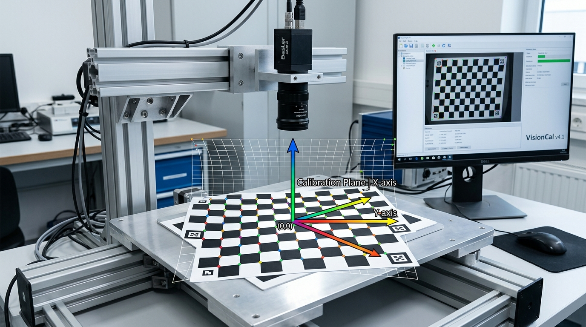

# TÀI LIỆU ĐÀO TẠO KỸ SƯ VISION — PHẦN 2
## THIẾT LẬP CAMERA CÔNG NGHIỆP VÀ HIỆU CHUẨN QUANG HỌC (CAMERA & CALIBRATION)

---

## 1. HỆ THỐNG TRỪU TƯỢNG HÓA CAMERA ĐA HÃNG

Hệ thống **CMS VINA VISION SYSTEM** áp dụng kiến trúc phần cứng trừu tượng (`ICameraDriver`, `CameraDriverFactory`), cho phép kỹ sư kết nối linh hoạt với hầu hết các chủng loại camera công nghiệp trên thị trường mà không làm thay đổi luồng xử lý ứng dụng:

```
                              ICameraDriver Architecture
                                   ┌─────────────────┐
                                   │  ICameraDriver  │
                                   └────────┬────────┘
                                            │
        ┌───────────────────┬───────────────┴───────────────┬───────────────────┐
        ▼                   ▼                               ▼                   ▼
┌───────────────┐   ┌───────────────┐               ┌───────────────┐   ┌───────────────┐
│ HikCamera     │   │ OpenCvCamera  │               │ RtspCamera    │   │ Simulator     │
│ (Hikrobot MVS)│   │ (USB DShow)   │               │ (IP Camera)   │   │ (Kiểm thử)    │
└───────────────┘   └───────────────┘               └───────────────┘   └───────────────┘
```

1. **Hikrobot MVS Driver (`HikCameraDriver`):**
   - Giao tiếp trực tiếp với SDK Hikrobot qua wrapper managed `MvCamCtrl.NET` (`MvCameraControl.dll`).
   - Hỗ trợ toàn diện Camera GigE Vision (truyền qua cáp mạng RJ45 LAN) và USB3 Vision (băng thông cao).
   - Tốc độ truyền khung hình không trễ, hỗ trợ xử lý luồng sự kiện phần cứng.
2. **OpenCV DirectShow Driver (`OpenCvCameraDriver`):**
   - Tương thích 100% với các camera chuẩn USB UVC (Webcam, USB Micro-Endoscope, DroidCam).
   - Tự động nhận diện tên thiết bị thực tế qua `DirectShowDeviceEnumerator`.
   - Hỗ trợ ép chuẩn nén MJPEG (`FourCC MJPG`) đạt 1080P @ 60-120 FPS trên cổng USB 2.0/3.0.
3. **RTSP IP Camera Driver:**
   - Kết nối với các camera an ninh, camera giám sát công xưởng qua đường dẫn chuẩn RTSP stream (`rtsp://user:pass@ip:port/stream1`).
4. **Simulator Mode (Camera Giả Lập):**
   - Chế độ nạp ảnh tĩnh từ thư mục đĩa cứng phục vụ cho kỹ sư viết thuật toán và kiểm thử offline khi chưa có phần cứng camera.
   - Hỗ trợ tùy chọn **"Tự xoay + di chuyển nhẹ"** để mô phỏng sai lệch phôi thực tế trên dây chuyền.

---

## 2. QUY TRÌNH KẾT NỐI VÀ CẤU HÌNH CAMERA CÔNG NGHIỆP HIKROBOT GIGE

### 2.1. Thiết lập phần cứng & Mạng Ethernet GigE
1. **Cấu hình Card mạng (NIC):**
   - Sử dụng cổng mạng Gigabit Ethernet chuyên dụng trên máy tính IPC (Intel I210/I219 hoặc tương đương).
   - Đặt IP tĩnh cho Card mạng máy tính (Ví dụ: `192.168.1.100`, Subnet Mask: `255.255.255.0`).
   - Đặt IP cho Camera GigE trong cùng dải mạng (Ví dụ: `192.168.1.101`).
2. **Kích hoạt Jumbo Frames (Bắt buộc với GigE Vision):**
   - Vào *Device Manager* ➔ *Network Adapters* ➔ Chuột phải vào Card mạng ➔ *Properties* ➔ *Advanced*.
   - Tìm mục **Jumbo Packet / Jumbo Frame** ➔ Chọn giá trị tối đa: **`9014 Bytes`** hoặc **`9 KB MTU`**.
   - Cài đặt IP tĩnh cùng dải mạng với Camera (Ví dụ Camera IP: `192.168.1.10` ➔ Đặt IP Card mạng IPC: `192.168.1.100`, Subnet Mask: `255.255.255.0`).
2. Mở ứng dụng Vision, chuyển sang màn hình **Live Camera (`F1`)**:
   - Camera Hikrobot sẽ tự động được nhận diện qua giao thức GigE Vision.
   - Nhấp nút **"▶ Bật Live View"** để kiểm tra luồng video thời gian thực.
3. Tối ưu hóa các thông số quang học trên thanh điều khiển:

| THÔNG SỐ QUANG HỌC | GIÁ TRỊ KHUYẾN NGHỊ | Ý NGHĨA KỸ THUẬT |
| :--- | :--- | :--- |
| **`Exposure Time (Phơi sáng)`** | `5,000 ~ 15,000 µs` (5 ~ 15 ms) | Tùy chỉnh theo tốc độ di chuyển của phôi; thời gian phơi sáng càng ngắn thì phôi chuyển động càng không bị nhòe mờ. |
| **`Gain (Độ nhạy sáng)`** | `0.0 ~ 2.0 dB` | Hạn chế tăng Gain quá cao để tránh nhiễu hạt (noise) trên bề mặt sản phẩm. |
| **`Trigger Mode`** | `Software` hoặc `Line 1 (Hardware)` | `Software` khi kiểm tra thủ công; `Line 1` khi nhận xung kích hoạt từ cảm biến / PLC qua cổng I/O 6-pin. |

> [!TIP]
> **Quy tắc vàng điều chỉnh ánh sáng cho Kỹ sư Vision:**
> 1. Luôn ưu tiên tăng độ sáng của bộ đèn LED trước khi tăng Gain của camera.
> 2. Giữ `Gain = 0 dB` hoặc ≤ 4 dB để ảnh có độ sắc nét cực đại, không bị nhiễu hạt muối tiêu (Gaussian noise).
> 3. Với sản phẩm kim loại bóng (nhôm, inox, linh kiện xi mạ): Đặt Gamma ≈ 0.7 - 0.8 kết hợp kính phân cực (Polarizer) để triệt tiêu vệt lóa phản quang.

---

## 3. HIỆU CHUẨN ĐỘ PHÂN GIẢI QUANG HỌC (2-POINT CALIBRATION)

### 3.1. Khái niệm PixelsPerMm
Camera chụp ảnh thu được các tọa độ tính bằng đơn vị **Điểm ảnh (Pixel)**. Để phần mềm xuất được kết quả đo kích thước bằng đơn vị **Milimét (mm)** chuẩn cơ khí, hệ thống cần biết hệ số quy đổi:

$$\text{PixelsPerMm} = \frac{\text{Khoảng cách tính bằng Pixel}}{\text{Khoảng cách thực tế tính bằng mm}}$$

### 3.2. Trình tự thực hiện hiệu chuẩn 2 điểm
1. Đặt một thước đo dưỡng chuẩn (Caliper Gauge) hoặc tiêu bản thủy tinh có vạch chia chính xác **10.00 mm** dưới tầm nhìn camera.
2. Trên màn hình, nhấp vào menu **`📐 Hiệu Chuẩn` ➔ `📐 Hiệu Chuẩn Tỉ Lệ Pixels/Mm (2 Điểm)...`**.
3. Cửa sổ `CalibrationDialog` xuất hiện:
   - Dùng chuột nhấp và kéo 2 đầu mút của thước ngắm trên ảnh vào 2 vạch đo chuẩn (Điểm 1 và Điểm 2).
   - Ô *Độ dài pixel (px)* sẽ tự động cập nhật (Ví dụ: `542.40 px`).
   - Nhập vào ô *Kích thước thực tế (mm)*: `10.00`.
   - Nhấp nút **"⚡ Tính Toán & Áp Dụng"**.
4. Phần mềm tự động tính ra:

$$\text{PixelsPerMm} = \frac{542.40}{10.00} = 54.24\text{ px/mm}$$

   Hệ số này ngay lập tức được lưu vào tệp Job và tự động áp dụng cho tất cả các Tool đo kích thước (Caliper, CircleFinder, Distance, LineLineDistance).

---

## 4. HIỆU CHUẨN CAMERA BÀN CỜ (CHESSBOARD CAMERA CALIBRATION)

### 4.1. Bản chất hiện tượng méo thấu kính (Lens Distortion)
Trong thực tế quang học, các thấu kính góc rộng hoặc giá thành phổ thông luôn tồn tại hiện tượng méo phi cầu:
- **Méo dạng thùng (Barrel Distortion):** Các cạnh ngoài bị phình cong ra ngoài (phổ biến với tiêu cự ngắn).
- **Méo dạng gối (Pincushion Distortion):** Các cạnh ngoài bị co thắt vào tâm.
- **Méo tiếp tuyến (Tangential Distortion):** Do thấu kính lắp không song song tuyệt đối với cảm biến CMOS.

Nếu không khử biến dạng, một đường thẳng kim loại ngoài thực tế khi chụp lên ảnh sẽ bị cong, dẫn đến kết quả đo kích thước ngoài biên bị sai số từ 0.2 mm đến hàng milimet!


*Hình 3: Thiết lập bàn cờ chuẩn (Chessboard Target) để hiệu chuẩn ma trận nội suy camera và khử biến dạng thấu kính*

---

### 4.2. Quy trình thực hiện Chessboard Calibration trên CMS VINA Vision System

1. **Chuẩn bị tấm bia bàn cờ (Chessboard Target):**
   - Sử dụng tấm chuẩn quang học phẳng tuyệt đối với lưới 8 × 6 góc vuông bên trong (Inner Corners).
   - Kích thước mỗi ô vuông tiêu chuẩn: 29.00 mm (hoặc tấm chính xác 10.00 mm, 5.00 mm tùy trường nhìn FOV).
2. **Mở cửa sổ hiệu chuẩn bàn cờ:**
   - Vào menu **`📐 Hiệu Chuẩn` ➔ `♟️ Hiệu Chuẩn Camera Bàn Cờ (Chessboard Calib)...`**.
3. **Thu thập tập ảnh mẫu (≥ 3 ảnh ở các góc độ khác nhau):**
   - Đặt tấm bàn cờ phẳng dưới camera, nhấp **"📷 Chụp Ảnh Mẫu"** (hoặc nạp từ thư mục).
   - Xê dịch tấm bàn cờ sang trái, sang phải, lên trên, xuống dưới và nghiêng nhẹ một góc 5° - 10° để camera chụp được đầy đủ các vùng biên của thấu kính.
   - Khi phát hiện thành công, phần mềm sẽ vẽ các đường nối cầu vồng rực rỡ bám chặt vào các góc ô cờ (`CornerSubPix` với độ chính xác dưới 0.1 pixel).
4. **Tính toán ma trận và khử méo (Calibrate):**
   - Nhấp nút **"📐 Tính Toán Hiệu Chuẩn (Calibrate)"**.
   - Thuật toán giải phương trình tối ưu hóa phi tuyến Levenberg-Marquardt của OpenCV sẽ tính ra:
     - **Camera Matrix K:** Tiêu cự fx, fy và điểm quang tâm cx, cy.
     - **Distortion Coefficients:** k1, k2, p1, p2, k3.
     - **Reprojection Error (Sai số tái chiếu):** Đạt chuẩn công nghiệp nếu < 0.5 pixel (Lý tưởng: 0.08 - 0.25 px).
5. **Cơ chế Cưỡng Chế Áp Dụng Toàn Cục (`Force Apply Global Calibration`):**
   - Sau khi hiệu chuẩn xong, nhấp nút **"Set As Global Calib"**.
   - Tích chọn CheckBox **`☑ Cưỡng chế áp dụng Global Calib (nếu có)`**.
   - *Cơ chế hoạt động:* Bất kể máy nạp tệp Job nào, hệ thống sẽ tự động ghi đè thông số khử méo thấu kính và tỷ lệ `PixelsPerMm` toàn cục chuẩn của trạm camera này, bảo đảm không bao giờ bị sai lệch khi mở các file Job cũ được tạo từ máy tính khác!
6. **Kích hoạt trên Node ImageSource:**
   - Trong `Tool Editor`, chọn node `ImageSource`, tại bảng Properties bên phải tích chọn **`☑ Undistort (Calib)`**. Toàn bộ luồng xử lý từ đây về sau sẽ nhận được bức ảnh phẳng tuyệt đối, mọi đường thẳng ngoài thực tế đều là đường thẳng trên ảnh.
