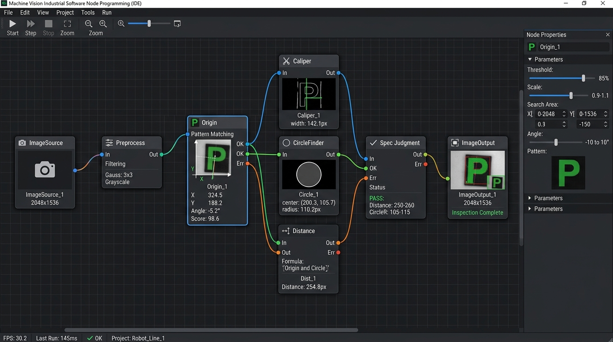

# TÀI LIỆU ĐÀO TẠO KỸ SƯ VISION — PHẦN 3
## LẬP TRÌNH ĐỒ THỊ TOOL VÀ THIẾT KẾ THUẬT TOÁN ĐO KIỂM (TOOL GRAPH & ALGORITHMS)

---

## 1. KHÁI NIỆM ĐỒ THỊ NODE GRAPH TRONG VISION SYSTEM

Hệ thống **CMS VINA VISION SYSTEM** sử dụng phương pháp lập trình trực quan dựa trên đồ thị luồng dữ liệu (Visual Dataflow Programming). Thay vì phải viết hàng ngàn dòng code C++, kỹ sư kéo thả các khối chức năng (**Nodes**) lên mặt phẳng vẽ đồ thị (**Canvas**) và kết nối chúng bằng các đường dây logic (**Edges**).


*Hình 4: Thiết kế luồng kiểm tra trực quan trên Tool Editor Canvas (Từ nguồn ảnh ➔ Tiền xử lý ➔ Gốc tọa độ Origin ➔ Các công cụ đo lường ➔ Đánh giá tiêu chuẩn ➔ Xuất ảnh)*

### 1.1. Cấu trúc của một Node
Mỗi Node trên Canvas đại diện cho một bước xử lý cụ thể và bao gồm:
- **Tiêu đề Node (Header):** Tên định danh (duy nhất trong một Job, ví dụ: `Origin_1`, `Circle_Pin1`).
- **Cổng đầu vào (Input Ports - Phía bên trái):** Nhận hình ảnh (`Image`) hoặc giá trị tham chiếu hình học (`P1`, `P2`, `L1`, `Distance`...).
- **Cổng đầu ra (Output Ports - Phía bên phải):** Xuất hình ảnh đã xử lý hoặc kết quả tính toán (`Result`, `Pass/Fail`, `Cx`, `Cy`...).
- **Khu vực hiển thị nhanh (Runtime & Status):** Hiển thị thời gian thực thi (ms) và trạng thái chạy gần nhất.
- **Tính năng hữu ích:** Nhấp đúp chuột vào bất kỳ cổng Output nào để mở hộp thoại xem nhanh giá trị thực tế vừa chạy (`PortValueDialog`).

### 1.2. Thao tác trên Canvas
- **Di chuyển khung nhìn (Pan):** Giữ chuột trái trên vùng trống Canvas và kéo (hoặc giữ chuột giữa).
- **Phóng to / Thu nhỏ (Zoom):** Lăn bánh xe cuộn chuột.
- **Tự động vừa khung hình (Fit View):** Nhấp nút **`🎯 Fit View`** để toàn bộ đồ thị tự động căn giữa vừa vặn với màn hình.
- **Nối dây (Connect):** Nhấp chuột giữ từ Output port của Node nguồn ➔ kéo rê và thả vào Input port của Node đích. Dây nối Bezier sẽ tự động định tuyến mượt mà.
- **Xóa (Delete):** Nhấp chọn Node hoặc Cạnh kết nối (chuyển sang màu đỏ) và nhấn phím **`Delete`**.

---

## 2. LÀM CHỦ CÔNG CỤ GỐC TỌA ĐỘ ORIGIN (REFERENCE POSITIONING)

Trong sản xuất thực tế, mỗi lần công nhân đặt sản phẩm vào đồ gá luôn xuất hiện sai lệch vị trí theo phương ngang (ΔX), phương dọc (ΔY) và góc nghiêng xoay (Δθ).

**Tool Origin** là công cụ quan trọng số 1: Nó tìm kiếm mẫu chuẩn trên bức ảnh thực tế, tính toán góc xoay và độ lệch, từ đó tự động kéo theo toàn bộ các khung đo (ROI) của các công cụ phía sau bám sát theo sản phẩm (`MapToGlobal`).

```
    [Ảnh Thực Tế Bị Nghiêng +15°] ──► [Tool Origin Bắt Được Góc +15°]
                                                    │
                                                    ▼
                     [Tự động xoay toàn bộ Caliper, Circle, Line nghiêng +15°]
                                                    │
                                                    ▼
                                   [Đo chính xác 100% không bị lệch tâm]
```

### 2.1. So sánh 3 thuật toán Origin cốt lõi

| Thuật toán | Nguyên lý hoạt động | Tốc độ | Khuyên dùng khi nào? |
| :--- | :--- | :---: | :--- |
| **`MvpShapeMatch2`** *(Khuyên dùng)* | Mô hình vector hướng gradient thưa đa kim tự tháp (`Pyramid Sparse Vector Edge`) kết hợp Max Pooling 3x3. | **3 ~ 15 ms** | Sản phẩm xoay góc rộng (-180° … +180°), thay đổi độ sáng, kiểm tra tốc độ cao. |
| **`TemplateMatch`** | So khớp tương quan chuẩn hóa (Normalized Cross Correlation - NCC) trên ảnh xám. | **20 ~ 50 ms** | Sản phẩm có bề mặt nhiều vân chi tiết phong phú, ít bị xoay góc (< ±10°). |
| **`FeatureBased`** | Trích xuất đặc trưng SIFT + Lowe's Ratio (0.75) + RANSAC Homography Affine 2D. | **40 ~ 90 ms** | Bề mặt kim loại bị bóng lóa phức tạp hoặc có biến dạng co giãn nhẹ. |

### 2.2. Trình tự dạy mẫu Origin (Teaching Origin)
1. Kéo thả Tool `Origin` vào Canvas và nối cổng `Image` từ `ImageSource` hoặc `Preprocess`.
2. Trên màn hình Preview, dùng chuột kéo khung chữ nhật **`Origin T` (Template ROI)** bao trọn khu vực hoa văn đặc trưng của sản phẩm (ví dụ: Logo, góc định vị, cụm lỗ đặc biệt).
3. Khung chữ nhật lớn hơn **`Origin S` (Search ROI)** là vùng không gian mà camera sẽ tìm kiếm mẫu. Kéo rộng ra bao quát phạm vi di động của phôi.
4. Tại bảng Properties bên phải:
   - Chọn thuật toán: `MvpShapeMatch2`.
   - Cài đặt góc xoay: `MinAngle = -30.0°`, `MaxAngle = 30.0°`, `AngleStep = 0.5°`.
   - Cài đặt điểm số đạt: `MinScore = 0.75` (Mặc định 75%).
   - Nhấp nút **"💾 Lưu Template Origin"**.
   - *Kết quả:* Hình ảnh mẫu xuất hiện trong khung xem trước `Origin_TemplatePreviewImage`. Khi bấm `Run Once`, phần mềm sẽ vẽ tâm ngắm Crosshair xanh và khung viền bao quanh mẫu vật thể tìm được.

---

## 3. BỘ CÔNG CỤ ĐO LƯỜNG KÍCH THƯỚC CHÍNH XÁC (DIMENSIONAL MEASUREMENT)

### 3.1. Tool Caliper & EdgePairDetect (Đo Chiều Rộng / Khe Hở Mép)
- **Nguyên lý:** Quét các thanh tia (Strips) vuông góc với mép phôi, sử dụng đạo hàm bậc 1 Sobel để tìm điểm chuyển đổi độ xám lớn nhất với độ chính xác **Sub-pixel (dưới 0.05 pixel)**.
- **Các tham số quan trọng:**
  - `Polarity` (Cực tính mép): `DarkToLight` (Tối sang Sáng), `LightToDark` (Sáng sang Tối), hoặc `Any` (Bất kỳ).
  - `MinEdgeStrength`: Ngưỡng độ dốc tối thiểu để lọc bỏ các vết xước hoặc bóng mờ.
  - `CaliperOrientation`: Hướng quét dọc (`Vertical`) hoặc ngang (`Horizontal`).

### 3.2. Tool CircleFinder (Tìm Tâm & Bán Kính Đường Tròn)
- **Nguyên lý:** Sử dụng công nghệ **Radial Caliper** tiên tiến (tương tự chuẩn phần mềm Cognex/Halcon):
  - Phóng ra N tia quét hướng tâm từ trong ra ngoài (hoặc từ ngoài vào trong).
  - Bắt các điểm biên Sub-pixel dọc theo mỗi thanh quét.
  - Áp dụng thuật toán **RANSAC + Kasa Least-Squares** để loại bỏ các điểm dị biệt (phoi bám, vết nứt) và khớp thành đường tròn hoàn hảo.
- **Đầu ra:** Tọa độ tâm (Cx, Cy), Bán kính R và Đường kính D quy đổi ra mm.

### 3.3. Tool Distance, LineLineDistance & Angle
- **Distance:** Nối 2 cổng điểm `P1` và `P2` để tính khoảng cách đường chim bay giữa 2 tâm lỗ hoặc 2 đỉnh.
- **LineLineDistance:** Tính khoảng cách giữa 2 cạnh song song (Hỗ trợ 5 chế độ: Điểm gần nhất, Điểm xa nhất, Trung điểm, Chiếu vuông góc).
- **Angle:** Nối 2 đường `L1` và `L2` để tính góc vát, góc vuông hoặc góc côn giữa 2 bề mặt cơ khí.

### 3.4. Cài đặt Tiêu Chuẩn Dung Sai & Tính Toán Over Spec
Mỗi phép đo đều cho phép kỹ sư nhập tiêu chuẩn kỹ thuật:
- **Tiêu chuẩn (Nominal):** Kích thước danh định theo bản vẽ (Ví dụ: `12.00 mm`).
- **Dung sai trên (Upper Tol):** `+0.05 mm` ➔ Giới hạn Max: `12.05 mm`.
- **Dung sai dưới (Lower Tol):** `-0.05 mm` ➔ Giới hạn Min: `11.95 mm`.

**Cơ chế Over Spec:**
- Nếu giá trị đo được là `12.18 mm`: Hệ thống đánh giá **NG**, tự động tính độ lệch Over Spec là **`+0.18 mm`** và gán mô tả **`"Vượt cận trên"`** hiển thị màu đỏ trên bảng kết quả.
- Nếu giá trị đo được là `11.90 mm`: Hệ thống đánh giá **NG**, Over Spec là **`-0.05 mm`** và gán mô tả **`"Vượt cận dưới"`**.

---

## 4. BỘ CÔNG CỤ KIỂM TRA NGOẠI QUAN & AI OCR

### 4.1. Tool BlobDetection (Phát Hiện Đốm Bọt Khí / Dị Vật)
- Phân đoạn nhị phân (Thresholding Otsu / Adaptive) và phân tích các vùng liên thông (Connected Components).
- Lọc theo dải diện tích: `MinArea … MaxArea` (pixel hoặc mm²).
- Khung ROI của Blob tự động xoay nghiêng theo Origin, giúp đếm chính xác số lượng khuyết tật trên từng chi tiết xoay.

### 4.2. Tool SurfaceCompare (So Sánh Biến Thiên Bề Mặt)
- Lưu ảnh phôi hoàn hảo làm mẫu (`surface_template.png`).
- So sánh phôi thực tế bằng 3 thuật toán cao cấp:
  - `AbsDiff`: Sai phân tuyệt đối cơ bản.
  - `SSIM` (Structural Similarity Index): So khớp tương đồng cấu trúc, kháng nhiễu ánh sáng thay đổi toàn cục.
  - `GradientAdaptive`: Kết hợp độ dốc Sobel, triệt tiêu bóng mờ phản chiếu từ môi trường.

### 4.3. Tool ContourCompare (So Khớp Biên Dạng ICP)
- Trích xuất viền vector của sản phẩm.
- Sử dụng thuật toán **nắn khớp ICP (Iterative Closest Point)** đa điểm với hàm mất mát Robust Loss.
- **Hiển thị màu trực quan:** Các đường viền ký tự/biểu tượng đạt tiêu chuẩn hiển thị **MÀU XANH LÁ (Lime)**; các đoạn viền bị mẻ, khuyết tật hoặc dính bavia hiển thị **MÀU ĐỎ TƯƠI (Red)**.

### 4.4. Tool OCR (Dạy Chữ MVS & AI ONNX Runtime)
- **Phương pháp 1: Dạy ký tự mẫu (Character Font Training chuẩn Hikrobot MVS):**
  - Nhập chuỗi mẫu vào `ExpectedText` (Ví dụ: `CMS-2026`).
  - Đặt ROI bao quanh dòng chữ và bấm **"🎓 Dạy chữ từ ROI"**.
  - Phần mềm tự động cắt từng ký tự, chuẩn hóa nhị phân 24 × 32 và lưu trực tiếp vào Job. Khi nhận diện, thuật toán so khớp ưu tiên số 1 với bộ font đã dạy, triệt tiêu hoàn toàn lỗi nhận diện sai font công nghiệp đặc thù.
- **Phương pháp 2: AI Deep Learning ONNX Model:**
  - Nhấp nút **"Mở thư mục"** để copy model nhận dạng chữ vào `models/ocr/` (Ví dụ: `en_PP-OCRv3_rec_infer.onnx`).
  - Hệ thống tự động phân tích cấu trúc Tensor, tích hợp CTC Greedy Decoder giải mã chuỗi ký tự độ chính xác 99.9%.

### 4.5. Tool CodeDetection (Đọc Mã 360° Đa Tầng)
- Hỗ trợ đầy đủ các định dạng mã công nghiệp: **QR Code**, **DataMatrix ECC 200**, **Code 128**, **Code 39**, **EAN-13**, **PDF417**.
- Tích hợp động cơ đọc mã 360° đa tầng (16 bước góc mịn 15°), xoay ảnh không xén biên (`RotateImageNoClip`), đọc thành công 100% các mã khắc laser bị xoay nghiêng bất kỳ hướng nào.
